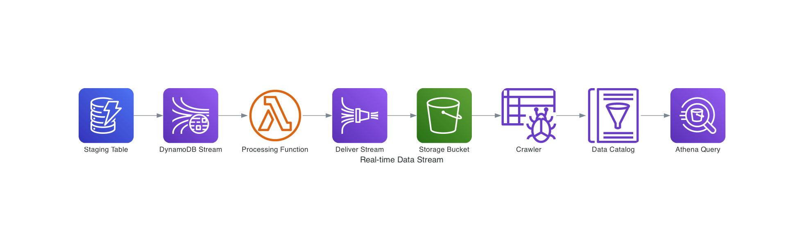

# Real-time Data Stream Framework
Tutorial of Real-time Data Streaming Architecture Based on AWS Kinesis Firehose & AWS GLue Crawlers

## ERD


## Execution

- Dependency Installation
```
pip install -r */requirements.txt
```
- Build:
```
sam build -u
```
- Local Testing:
```
sam local invoke "StreamingFunction" -e event.json --env-vars channels/variables.json
```
- Deploy:
```
sam deploy --parameter-overrides Environment=dev
```